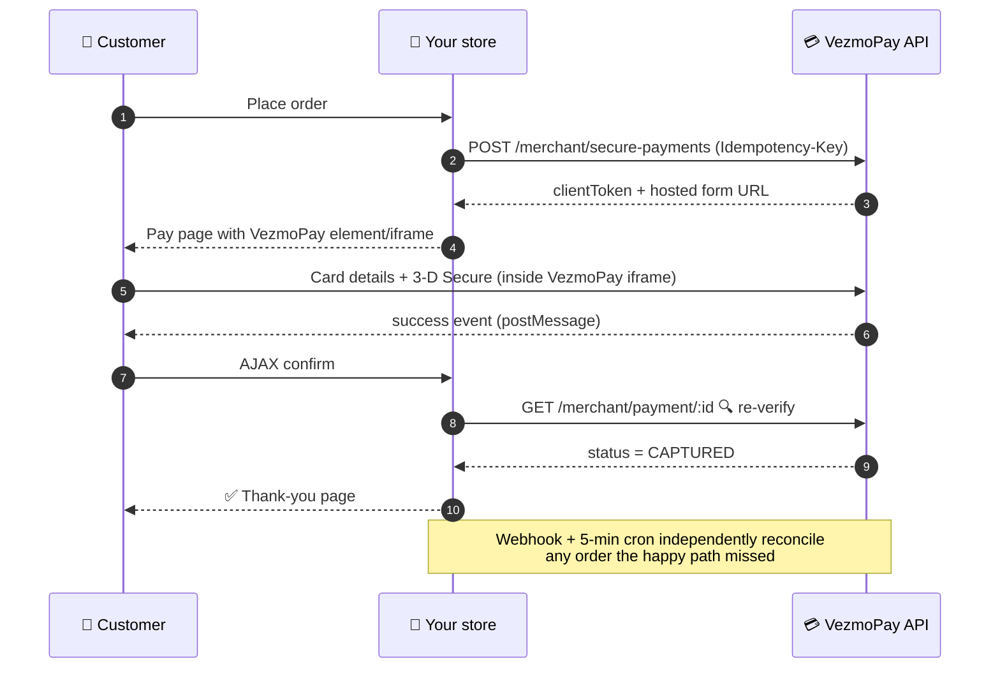

<div align="center">

# 💳 VezmoPay for WooCommerce

**Accept payments through VezmoPay — three integration modes, zero card data on your server.**

[](https://github.com/ACCEPT-GLOBAL-LIMITED/vezmoPay-wooCommerce/releases)
[](https://wordpress.org)
[](https://woocommerce.com)
[](https://php.net)
[](https://woocommerce.com/document/high-performance-order-storage/)
[](https://woocommerce.com/checkout-blocks/)
[](#-security-model)
[](LICENSE)

*Cards · US bank accounts (ACH) · 3-D Secure — all handled on VezmoPay-hosted surfaces.*

[Quick start](#-quick-start) · [Integration modes](#-pick-your-integration-mode) · [How it works](#%EF%B8%8F-how-a-payment-flows) · [Security](#-security-model) · [FAQ](#-faq) · [Developers](#-for-developers)

</div>

---

## ✨ Why this plugin

| | |
|---|---|
| 🎛️ **Three integration modes** | Inline payment element, secure iframe, or full hosted checkout — switch with one dropdown, no code. |
| 🛡️ **Paranoid by design** | Webhooks are treated as *hints*, never as truth. Every event is re-verified against the VezmoPay API before an order changes. Amount mismatches put orders on hold instead of completing them. |
| 🧱 **Modern WooCommerce native** | High-Performance Order Storage (HPOS) ✓ · Cart & Checkout Blocks ✓ · classic shortcode checkout ✓ |
| 🔁 **Self-healing orders** | postMessage events → AJAX confirm → status polling → webhooks → WP-Cron reconciliation → manual *"Check VezmoPay payment status"* action. Five layers deep; if one path fails, the next one completes the order. |
| 🧪 **Real test mode** | Separate Test/Live credentials and base URLs, one-click **Test connection**, and unmistakable TEST MODE banners in admin *and* at checkout. |
| 🔐 **Secrets stay secret** | Keys can live in `wp-config.php` constants instead of the database. Debug logs redact every key, token and secret automatically. |
| 💤 **Zero-duplicate charges** | Idempotency keys on every payment creation — refreshes, retries and double-clicks can never double-charge. |

## 🧭 Pick your integration mode

```
                         Where does the customer pay?
        ┌──────────────────────────┼──────────────────────────┐
        ▼                          ▼                          ▼
┌────────────────┐        ┌────────────────┐        ┌────────────────┐
│ INLINE ELEMENT │        │ SECURE IFRAME  │        │ HOSTED CHECKOUT│
│  (vezmo.js)    │        │                │        │   (paylink)    │
│ on your site   │        │ on your site   │        │ on VezmoPay    │
└────────────────┘        └────────────────┘        └────────────────┘
```

| | 🧩 Inline element | 🖼️ Secure iframe | 🚀 Hosted checkout |
|---|---|---|---|
| Customer stays on your site | ✅ | ✅ | ❌ redirects to VezmoPay |
| Powered by | `vezmo.js` SDK + postMessage events | Direct iframe embed | VezmoPay paylink page |
| Order finalized by | SDK `success` event → server re-verify (polling fallback) | Status polling → server re-verify | Webhook + cron reconciliation |
| Works with JS disabled | ➖ falls back to iframe | ✅ payment still completes | ✅ |
| Extra setup | Add store origin to VezmoPay **trusted origins** | none | none |
| Best for | The smoothest on-site UX (default) | Maximum robustness | Getting live in minutes |

> 🔒 **In every mode** the card form is rendered by VezmoPay (a Stripe Payment Element inside a VezmoPay-hosted page). Card numbers never touch your server or your page's DOM.

## 🚀 Quick start

### 1 — Install

```bash
# from your WordPress root
cd wp-content/plugins
git clone https://github.com/ACCEPT-GLOBAL-LIMITED/vezmoPay-wooCommerce.git vezmopay-woocommerce
wp plugin activate vezmopay-woocommerce
```

…or upload the zip via **Plugins → Add New → Upload**. Requires WordPress 6.0+, WooCommerce 8.0+, PHP 7.4+.

### 2 — Create your API key 🔑

In the **VezmoPay dashboard → Settings → API Keys**, create a key with these permissions:

```
secure-payment.create   paylink.create   paylink.read   payment.read
```

> ⚠️ Copy the key (`vzm_…`) **and** secret immediately — the secret is shown only once, and creating a new key deactivates your previous one.

### 3 — Connect the store 🔌

**WooCommerce → Settings → Payments → VezmoPay**

1. Choose your **Environment** (start with *Test*).
2. Paste the API key + secret and **Save**.
3. Click **Test connection** — you should see *“Connected to VezmoPay (test environment). Credentials are valid.”*

<details>
<summary>🔐 Prefer to keep secrets out of the database?</summary>

Define these in `wp-config.php` — they override anything saved in settings:

```php
define( 'VEZMOPAY_TEST_API_KEY',    'vzm_xxxxxxxxxxxxxxxx' );
define( 'VEZMOPAY_TEST_API_SECRET', '…' );
define( 'VEZMOPAY_LIVE_API_KEY',    'vzm_xxxxxxxxxxxxxxxx' );
define( 'VEZMOPAY_LIVE_API_SECRET', '…' );
```
</details>

### 4 — Register the webhook 📡

In the VezmoPay dashboard, add a webhook endpoint:

| Setting | Value |
|---|---|
| URL | `https://your-store.example/wp-json/vezmopay/v1/webhook` |
| Events | `payment.success`, `payment.failed` |

Copy the `whsec_…` secret (shown once) into the plugin's **Webhook secret** field.

### 5 — (Element mode) Add a trusted origin 🌐

Using the **inline element**? Add your store origin (e.g. `https://your-store.example`) to **trusted origins** in the VezmoPay dashboard so the payment element can send success events to your page. Skip it and payments still complete via the polling fallback — just a few seconds slower.

### 6 — Test drive 🏁

Place an order in Test mode. Inside the VezmoPay form, the standard Stripe test cards work:

| Card | Result |
|---|---|
| `4242 4242 4242 4242` | ✅ Instant success |
| `4000 0027 6000 3184` | 🔐 3-D Secure challenge |
| `4000 0000 0000 0002` | ❌ Declined |

When everything looks right: flip **Environment → Live**, paste your live key, re-test the connection, and go. 🎉

## ⚙️ How a payment flows



**Order status mapping** — driven by the *verified* API state, never by the payload:

| VezmoPay status | WooCommerce order | Note added |
|---|---|---|
| `CAPTURED` | ✅ Processing/Completed (`payment_complete`) | transaction ID stored |
| `AUTHORIZED` (ACH settling) | ⏸️ On hold | bank settlement pending |
| `FAILED` | ❌ Failed | reason logged |
| `REFUNDED` | ↩️ Refunded | refunded on VezmoPay side |
| amount ≠ order total | 🚨 On hold | never auto-completed |

## 🛡️ Security model

- **Webhooks are never trusted.** VezmoPay does not currently sign deliveries, so the plugin treats every webhook as an unauthenticated hint: it looks up the order only by references *it* stored, then re-fetches the payment from the API over your authenticated connection before changing anything. If VezmoPay enables signing, the `X-Webhook-Signature` HMAC is verified automatically with your `whsec_` secret.
- **Event deduplication** — envelope IDs are remembered per order; VezmoPay's 4-attempt/24-hour retry schedule can never double-process.
- **Guest-safe AJAX** — the confirm/status endpoints require both a nonce and the order key, so customers can only ever touch their own order.
- **SAQ-A PCI scope** — card fields live exclusively on VezmoPay-hosted surfaces; 3-D Secure runs inside them too.
- **Redacted logging** — enable debug logs (WooCommerce → Status → Logs, source `vezmopay`) without ever leaking `vzm_` keys, bearer tokens, or `whsec_` secrets.
- **Currency guard** — the platform currently mishandles zero-decimal currencies (JPY, KRW, VND, …), so the gateway hides itself for those rather than risk a 100× charge.

## 📋 Feature matrix

| Feature | Status |
|---|---|
| Cards + US bank (ACH) payments | ✅ |
| 3-D Secure / SCA | ✅ handled inside the VezmoPay element |
| Hosted checkout / inline element / iframe modes | ✅ setting-selectable |
| Classic checkout **and** Checkout Blocks | ✅ |
| HPOS (custom order tables) | ✅ |
| Test/Live environments + test connection | ✅ |
| Idempotent payment creation | ✅ |
| Webhooks with API re-verification | ✅ |
| Cron + manual order reconciliation | ✅ |
| Multi-currency (2-decimal currencies) | ✅ |
| Refunds from WooCommerce | ⛔ platform has no refund API — refund from the VezmoPay dashboard; the order syncs on next verification |
| Saved cards / tokenization | ⛔ no vault API on the platform yet |
| WooCommerce Subscriptions / Pre-Orders | ⛔ requires off-session charging the platform doesn't expose |
| Authorize-then-capture | ⛔ platform captures immediately |
| Apple Pay / Google Pay in embedded modes | ⛔ not exposed by the platform's embed |
| Hosted-checkout redirect back to store | ⛔ no return-URL support yet — orders complete via webhook/cron |

Every ⛔ is a **platform** limitation verified against the VezmoPay API source — the full audit lives in [`docs/FEATURE-MAPPING.md`](docs/FEATURE-MAPPING.md) and [`docs/VEZMOPAY-API-CONTRACT.md`](docs/VEZMOPAY-API-CONTRACT.md). The plugin is structured so each one can light up the moment the API ships it.

## ❓ FAQ

<details>
<summary><strong>How do I refund an order?</strong></summary>

From your VezmoPay dashboard — the platform doesn't expose a merchant refund API yet. Trying it from the WooCommerce order screen shows a clear explanation instead of failing silently, and the order is marked refunded the next time the plugin verifies that payment.
</details>

<details>
<summary><strong>The customer paid on the hosted checkout but wasn't redirected back. Bug?</strong></summary>

No — VezmoPay paylink pages don't support return URLs yet. The order completes automatically via webhook (or the 5-minute cron as backup) and the customer gets the standard order confirmation email. Want customers to stay on your site? Use the inline element or iframe mode.
</details>

<details>
<summary><strong>Are unsigned webhooks a security hole?</strong></summary>

Not here. The plugin never acts on webhook payload data — an attacker who posts a forged `payment.success` only triggers a re-check against the real VezmoPay API, which reports the true status. Orders complete only from that authoritative record.
</details>

<details>
<summary><strong>Why doesn't the gateway show at checkout?</strong></summary>

Checklist: gateway enabled → API key + secret saved for the selected environment → **Test connection** passes → store currency isn't zero-decimal (JPY, KRW, VND…). The settings page shows a red notice for the currency case.
</details>

<details>
<summary><strong>Payments succeed but orders stay pending.</strong></summary>

Usually the webhook isn't registered (or points at the wrong URL). Verify the endpoint URL, and that `payment.success`/`payment.failed` are subscribed. Meanwhile the cron reconciler settles affected orders within ~5 minutes, and *Order actions → Check VezmoPay payment status* settles one instantly.
</details>

<details>
<summary><strong>Where are the logs?</strong></summary>

Enable **Debug logging** in the gateway settings → WooCommerce → Status → Logs → source `vezmopay`. All secrets are redacted before writing.
</details>

## 🧑‍💻 For developers

```
vezmopay-woocommerce/
├── vezmopay-woocommerce.php        ← bootstrap, autoloader, HPOS/Blocks declarations
├── includes/
│   ├── class-vezmopay-plugin.php       ← wiring: hooks, AJAX, cron, order actions
│   ├── class-vezmopay-gateway.php      ← WC_Payment_Gateway: 3 modes + state machine
│   ├── class-vezmopay-api-client.php   ← JWT auth, retries, idempotency, envelope unwrap
│   ├── class-vezmopay-webhook.php      ← REST receiver: verify → dedupe → re-verify
│   ├── class-vezmopay-settings.php     ← settings schema
│   ├── class-vezmopay-connect.php      ← test-connection (OAuth-ready slot)
│   ├── class-vezmopay-logger.php       ← WC_Logger wrapper with redaction
│   └── blocks/class-vezmopay-blocks-support.php
├── assets/js/                      ← element (SDK), iframe (polling), blocks tile
├── languages/                      ← .pot (i18n-ready)
└── docs/                           ← API contract · feature mapping · QA checklist
```

- 📐 **Architecture deep-dive:** [`DEVELOPER.md`](DEVELOPER.md) — auth flow, all three payment sequences, webhook trust model, order-meta reference, extension guide.
- 📜 **The verified API contract:** [`docs/VEZMOPAY-API-CONTRACT.md`](docs/VEZMOPAY-API-CONTRACT.md) — every endpoint, DTO and platform gap, extracted from the VezmoPay source. Nothing in this plugin is guessed.
- ✅ **QA:** [`docs/TEST-CHECKLIST.md`](docs/TEST-CHECKLIST.md) — ~50-point end-to-end checklist across all modes, both checkout types, webhook replay/tamper cases, HPOS.

```bash
# sanity checks
find . -name '*.php' -not -path './.git/*' -exec php -l {} \;
msgfmt --check-format -o /dev/null languages/vezmopay-woocommerce.pot
```

Contributions welcome — match WordPress Coding Standards, keep strings translatable (`vezmopay-woocommerce`), and never let a secret reach a log or the browser.

---

<div align="center">

**VezmoPay for WooCommerce** · v0.1.0 · GPL-2.0-or-later
Built by [ACCEPT GLOBAL LIMITED](https://vezmo.com)

*💡 Found an issue? [Open one](https://github.com/ACCEPT-GLOBAL-LIMITED/vezmoPay-wooCommerce/issues) — include the redacted `vezmopay` log if you can.*

</div>
